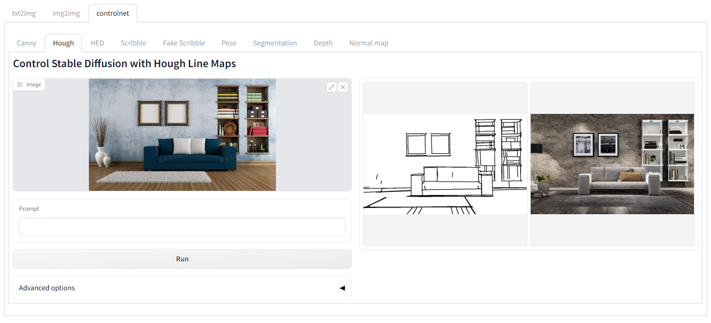

# AI Painter by OneFlow

support img2img, text2img and control net



A browser interface for [OneFlow Diffusers](https://github.com/Oneflow-Inc/diffusers) inspired by [Stable Diffusion Web UI](https://github.com/AUTOMATIC1111/stable-diffusion-webui).

## How to Run

Install depencies:

```bash
sh setup_env.sh
```

Launch the server:

```bash
python3 launch.py --ip 0.0.0.0 --port 7860
```

### Launch Options

There are other options besides `ip` and `port` mentioned above.

- `--ui-debug-mode`: launch without loading model
- `--graph-mode`: use OneFlow graph mode which will accelerate the inference (but limited by fixed tensor shape)
- `--device`: Target a specific device, eg: `cuda:0` means the first GPU and `cuda:1` means the second GPU

